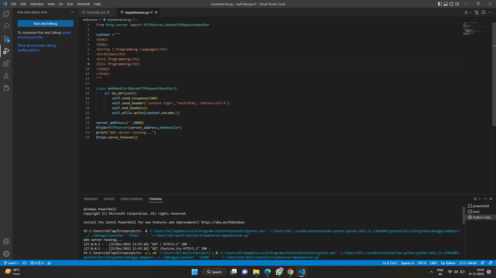
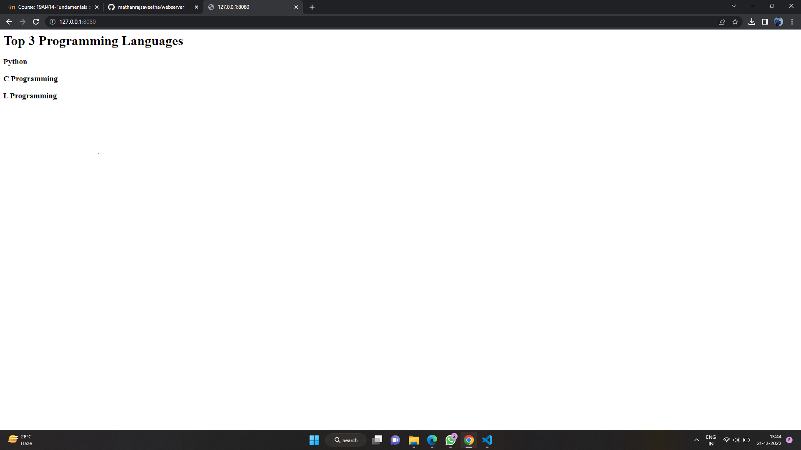

# Developing a Simple Webserver

# AIM:

To develop a program to display top 3 programming languages

## DESIGN STEPS:

### Step 1:

HTML content creation is done

### Step 2:

Design of webserver workflow

### Step 3:

Implementation using Python code

### Step 4:

Serving the HTML pages.

### Step 5:

Testing the webserver

## PROGRAM:
```
from http.server import HTTPServer,BaseHTTPRequestHandler

content ="""
<html>
<body>
<h1>Top 3 Programming Languages</h1>
<h3>Python</h3>
<h3>C Programming</h3>
<h3>PL Programming</h3>
</body>
</html>
"""

class WebHandler(BaseHTTPRequestHandler):
    def do_GET(self):
        self.send_response(200)
        self.send_header('content-type','text/html; charset=utf-8')
        self.end_headers()
        self.wfile.write(content.encode())
    
server_address=('',8080)
httpd=HTTPServer(server_address,WebHandler)
print("Web server running...")
httpd.serve_forever()
```
## OUTPUT:

### Server Side Output



### Client Side Output



## RESULT:
Thus the program is developed to display top 3 programming languages